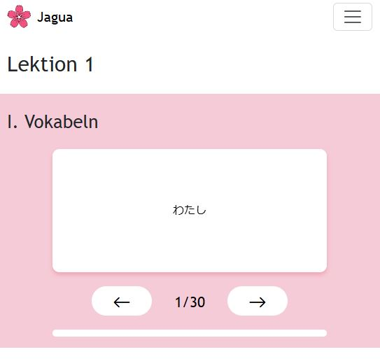
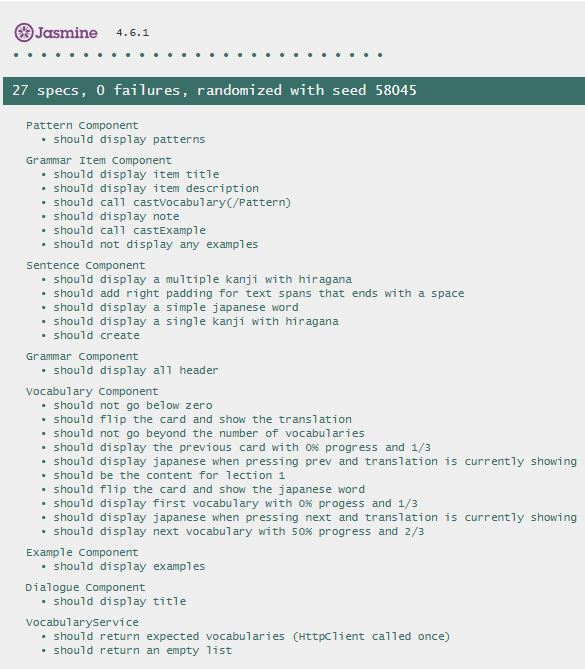
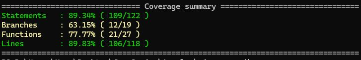
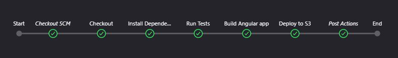
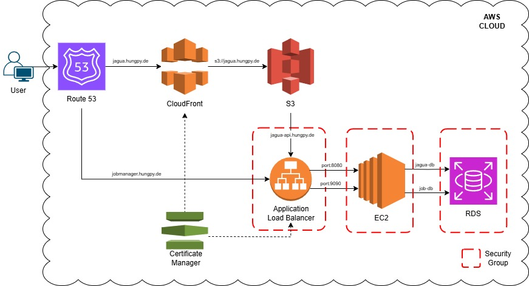

# 🌸 Jagua

Frontend logic for Jagua, a web application to learn japanese vocabulary, sentence pattern, examples, dialogues and grammar. 
Backend logic is maintened in the following repository: 
- https://github.com/Hungpai/jagua-backend-public

## Demo
Deployed on AWS via CloudFront and S3:
- https://jagua.hungpy.de/
  


## Features
- Responsive: adapts to large, medium and small screens
- Flipcard interaction 
- Structured learning content
- Future features:
  - Exercises
  - Hirana and Katakna practice
  - Kanji practice
  - More chapters

## Technologies
- Angular
- TypeScript
- HTML, CSS, Bootstrap
- Jasmine
- Jenkins

## Component Tests
- Each Component has a <component_name>.spec.ts file containing multiple unit tests to ensure expected functionality.
  


- Code coverage
  


## CI/CD
Jenkins Pipeline Stages:
1. Checkout
2. Install Dependencies
3. Testing
4. Build
5. Deploy
   



## Cloud
- Deployed on AWS using RDS, EC2, ALB, S3, Route 53, CloudFront and Certificate Manager.
  


## Development server

To start a local development server, run:

```bash
ng serve
```

Once the server is running, open your browser and navigate to `http://localhost:4200/`. The application will automatically reload whenever you modify any of the source files.

## Building

To build the project run:

```bash
ng build
```

This will compile your project and store the build artifacts in the `dist/` directory. By default, the production build optimizes your application for performance and speed.

## Running unit tests

To execute unit tests with the [Karma](https://karma-runner.github.io) test runner, use the following command:

```bash
ng test
```
